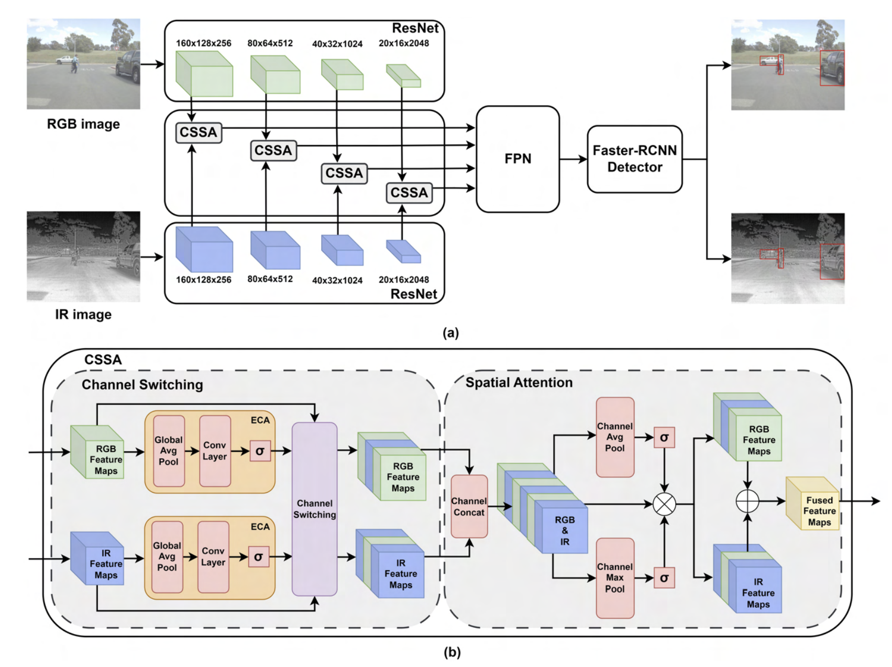
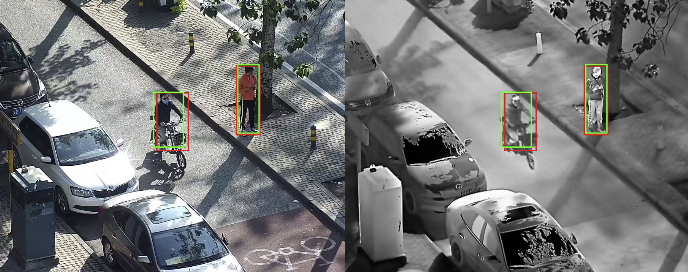

# Multimodal Object Detection by Channel Switching and Spatial Attention

<div style="text-align: center;">

</div> 

A reimplementation of the recent work "Multimodal Object Detection by Channel Switching and Spatial Attention" to verify core results. This project was taken during the duration of Carnegie Mellon University's Introduction to Deep Learning: 11-785.


## Usage

This repository has two main files `model-train.ipynb` and `baseline-train.ipynb`. Both files are self contained and verified to be usable on a V100 Google Colab instance with the High-RAM setting. We urge you to first familiarize yourself with `model-train.ipynb` since is more verbose is its instructions. Likely, you will not need to change much from the original code given here, in which case all cells can be ran sequentially. First however, you will need to comb over the cells to file sections with `fill-me-in` as these hold variables such as file paths and user keys which will vary from user to user. 


## Documentation

*Results from our best performing model on the LLVIP dataset. Weights for this model are saved in the assets folder*

Along with the working code, we offer two forms of documentation (found in `docs/`) covering our methods, implementations and results, they are as follows:

**MultimodelCSSA_Presentation.pdf**:\
A short PowerPoint which covers key concepts surrounding the Channel Switching and Spatial Attention (CSSA) Block, along with some high level results and detection visualization from our best performing model. A link to a verbal presentation of these slides can be found [here](https://youtu.be/DXMA3HgIk9I). 

**MultimodelCSSA_Report.pdf**:\
An extended report of our works, given in a standard IEEE format. Here we dive into more detail into our ablations, some extensions we made to work of the original author, as well as explain any differences we say between our work and theirs.  

## Citations:

We thank the following authors, first those of the original works for their creation of an interesting and novel idea and secondardily of LLVIP whose dataset was easy to use and highly applicable to the task at hand

*Multimodal Object Detection by Channel Switching and Spatial Attention*
```
@INPROCEEDINGS{10209020,
  author={Cao, Yue and Bin, Junchi and Hamari, Jozsef and Blasch, Erik and Liu, Zheng},
  booktitle={2023 IEEE/CVF Conference on Computer Vision and Pattern Recognition Workshops (CVPRW)}, 
  title={Multimodal Object Detection by Channel Switching and Spatial Attention}, 
  year={2023},
  volume={},
  number={},
  pages={403-411},
  keywords={Computer vision;Fuses;Computational modeling;Conferences;Object detection;Switches;Stability analysis},
  doi={10.1109/CVPRW59228.2023.00046}}

```

*LLVIP: A Visible-infrared Paired Dataset for Low-light Vision*
```
@inproceedings{jia2021llvip,
  title={LLVIP: A visible-infrared paired dataset for low-light vision},
  author={Jia, Xinyu and Zhu, Chuang and Li, Minzhen and Tang, Wenqi and Zhou, Wenli},
  booktitle={Proceedings of the IEEE/CVF International Conference on Computer Vision},
  pages={3496--3504},
  year={2021}
}
```